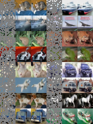

### Implementation of [*KaiMing He el.al. Masked Autoencoders Are Scalable Vision Learners*](https://arxiv.org/abs/2111.06377).

Due to limit resource available, we only test the model on cifar10. We mainly want to reproduce the result that **pre-training an ViT with MAE can achieve a better result than directly trained in supervised learning with labels**. This should be an evidence of **self-supervised learning is more data efficient than supervised learning**.

We mainly follow the implementation details in the paper. However, due to difference between Cifar10 and ImageNet, we make some modification:
- we use vit-tiny instead of vit-base.
- since Cifar10 have only 50k training data, we increase the pretraining epoch from 400 to 2000, and the warmup epoch from 40 to 200. We noticed that, the loss is still decreasing after 2000 epoches.
- we decrease the batch size for training the classifier from 1024 to 128 to mitigate the overfitting.

### Installation
`pip install -r requirements.txt`

### Run
```bash
# pretrained with mae
python mae_pretrain.py

# train classifier from scratch
python train_classifier.py

# train classifier from pretrained model
python train_classifier.py --pretrained_model_path vit-t-mae.pt --output_model_path vit-t-classifier-from_pretrained.pt
```

See logs by `tensorboard --logdir logs`.

### Result
|Model|Validation Acc|
|-----|--------------|
|ViT-T w/o pretrain|74.13|
|ViT-T w/  pretrain|**89.77**|

Weights are in [github release](https://github.com/IcarusWizard/MAE/releases/tag/cifar10). You can also view the tensorboard logs at [tensorboard.dev](https://tensorboard.dev/experiment/zngzZ89bTpyM1B2zVrD7Yw/#scalars).

Visualization of the first 16 images on Cifar10 validation dataset:

